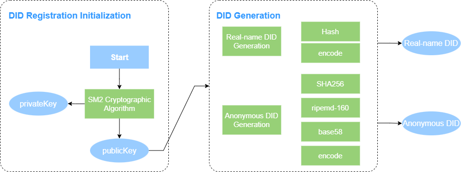

# Unitrust DID Method Specification

## About

`UniTrust DID` fully adheres to the latest [DID Specification v1.0 from W3C](https://www.w3.org/TR/did-core/). It functions as the identity data carrier within the governable digital identity system and provides the foundational architecture for the digital trust service platform.

## Abstract

`UniTrust DID` has developed a distributed digital identity system based on blockchain technology, designed to offer decentralized, secure, autonomous, and privacy-protected on-chain identity services for individuals, enterprises, institutions, and digital assets. By providing trusted digital identities, it enables users to control their data while addressing challenges related to privacy, data protection, security, and governance, facilitating seamless data flow between entities.

## Status of This Document

This document is currently at version `v1.0.0` for `UniTrust DID` and will be updated in accordance with the [W3C DID Core Specification](https://www.w3.org/TR/did-core/). The latest version of the document is available at https://www.sheca.com/.

## Unitrust DID Method

The `Unitrust DID` identifier is defined as: ```unitrust```. 

A DID using this method **MUST** begin with the prefix `did:unitrust`. The remainder of the DID, following the prefix, is the namespace-specific identifier, as detailed below.

```
UniTrust-DID = "did:unitrust:" unitrust-specific-identifier
unitrust-specific-identifier = 28*idchar
idchar = ALPHA / DIGIT
```

A valid `Unitrust DID` might be:

```
did:unitrust:51uYnBT3KXnbHowvEn5ksG23quaJ
```

The steps to generate a `UniTrust DID` are as follows:



## DID Document

The `UniTrust DID` document fully adheres to the [W3C DID Core Specification](https://www.w3.org/TR/did-core/) and includes several extensions based on the standard. The field definitions for the `UniTrust DID` document are as follows:

1. **`@context`**: A required field, which based on the [W3C DID Core](https://www.w3.org/TR/did-core/), enabling interoperability across different DID documents. The value of `@context` can either be a string or a JSON array:
   - When the value is a string, it must be `https://www.w3.org/ns/did/v1`.
   - When the value is a JSON array, the first element must be `https://www.w3.org/ns/did/v1`, followed by any other required JSON-LD rules.
2. **`id`**: A required field that specifies the DID of the document. It must follow the `UniTrust DID` [naming rules](#Unitrust-DID-Method) and be formatted as a JSON string.
3. **`versionId`**: A required field that specifies the version of the `UniTrust DID` document, represented as a JSON string.
4. **`controller`**: An optional field that specifies one or more controllers of the `UniTrust DID` document (those authorized to modify the document). The format can be either a JSON string or a JSON array.
5. **`created`**: A required field that indicates the creation time of the `UniTrust DID` document.
6. **`updated`**: A required field that indicates the last update time of the `UniTrust DID` document.
7. **`deactivated`**: A required field that indicates the deactivation status of the `UniTrust DID` document.
8. **`alsoKnownAs`**:  An optional field that specifies a set of URIs associated with this DID and be formatted as a JSON array.
9. **`verificationMethod`**:  An Optional field that specifies one or more verification methods.  Each element in the array must comply with the [W3C DID Core](https://www.w3.org/TR/did-core/) specification. The value is represented as a JSON array.
10. **`authentication`**:  An Optional field that specifies the authentication method for the DID Subject. The value is represented as a JSON array.
11. **`assertionMethod`**:  An optional field that specifies the verification method for statements made by the DID Subject (such as publishing a verifiable credential). The value is represented as a JSON array.
12. **`keyAgreement`**: An optional field that specifies the verification method for encrypted communications between the DID Subject and a counterpart (e.g., key negotiation for secure transmission). The value is a JSON array.
13. **`capabilityInvocation`**:  An optional field that specifies the verification method when the DID Subject requests server capabilities (such as authorization to update the DID document). The value is represented as a JSON array.
14. **`capabilityDelegation`**: An optional field that specifies the verification method when the DID Subject authorizes others to exercise certain capabilities (e.g., granting third-party access to an HTTP API). The value is represented as a JSON array.
15. **`service`**: An optional field that specifies service endpoints that interact with the DID Subject (for services like authentication, authorization, resource requests, etc.). The value is represented as a JSON array.
16. **`keyValidity`**: An optional extended field that specifies the validity information of the keys used in the verification method. The value is represented as a JSON array.
17. **`proof`**: An optional field that contains the signature information of the DID issuer.


An example of the DID document of ```did:unitrust:51uYnBT3KXnbHowvEn5ksG23quaJ``` is as follows:

```json
{
	"context": ["https://www.w3.org/ns/did/v1"],
	"id": "did:unitrust:51uYnBT3KXnbHowvEn5ksG23quaJ",
	"alsoKnownAs": [],
	"controller": ["did:unitrust:51uYnBT3KXnbHowvEn5ksG23quaJ", "did:unitrust:5LiUUEscVL5Lr3FNyEVw6mssCxVZ"],
	"verificationMethod": [{
		"id": "did:unitrust:51uYnBT3KXnbHowvEn5ksG23quaJ#key-1",
		"controller": "did:unitrust:51uYnBT3KXnbHowvEn5ksG23quaJ",
		"type": "SM3WithSM2",
		"publicKeyMultibase": "aSq9DsNNvGhYxYyqA9wd2eXLWTQu5hpJZ4oxTyeUYTNqw6aoARCqcd27xvUCadsdFgn19kxkR5385R33bkechfyP8sM4HJNQfsWV4WwuKTBoggjpzs7cW3Ywh3W2"
	}],
	"assertionMethod": ["did:unitrust:51uYnBT3KXnbHowvEn5ksG23quaJ#key-1"],
	"service": [{
		"id": "did:unitrust:51uYnBT3KXnbHowvEn5ksG23quaJ#test3333",
		"type": "1",
		"serviceEndpoint": "https://www.baidu.com"
	}],
	"created": "2024-09-25T21:40:59Z",
	"updated": "2024-09-25T21:40:59Z",
	"deactivated": false,
	"versionId": 1,
	"keyValidity": [{
		"id": "did:unitrust:51uYnBT3KXnbHowvEn5ksG23quaJ#key-1",
		"expiredTime": "2124-09-25T21:40:59Z",
		"permission": ""
	}],
	"proof": {
		"type": "SM3WithSM2",
		"created": "2024-09-25T21:40:59Z",
		"verificationMethod": "did:unitrust:5LiUUEscVL5Lr3FNyEVw6mssCxVZ#key-1",
		"proofPurpose": "assertionMethod",
		"proofValue": "AN1rKvtCbod9gvqTNc5fEtLRcXWoaLmusBdwiK7HecP43ZamjMM3RejJywK2bZvVc38HJjGRRu7uUm3NWdgy2JGm9mYcXXtHk"
	}
}
```


## CRUD Operations

The creation, update, and deactivation of a `UniTrust DID` document can only be initiated by its controller. Therefore, the `controller` field within the document must list all controllers associated with the DID. By default, the DID Subject is the controller of the document. All write operations involving the document require authentication through a verification method.

### Create

The `UniTrust DID` system provides three main operations for DID creation:

1. **Creating DIDs for Legal Entities**:
   To create a DID for a legal entity, a trusted legal entity’s real-name digital certificate is used to register a legal entity account. This process establishes a blockchain-based trusted account.
2. **Creating DIDs for Natural Persons**:
   For natural persons, a trusted natural person’s real-name digital certificate is used to register an individual account, enabling the creation of a blockchain-based trusted account.
3. **Creating Sub-DIDs for Existing DIDs**:
   A sub-DID can be created under an existing DID, enabling the creation of hierarchical identities within the blockchain network.

#### Request Parameters

| **Parameter** Name | **Type**             | Required | **Constraints**                | **Description**                                         |
| ------------------ | -------------------- | -------- | ------------------------------ | ------------------------------------------------------- |
| `certContent`      | `string`             | Yes      | `Max length: 65535`            | The real-name digital certificate.                      |
| `name`             | `string`             | Yes      | `Max length:255`               | The subject name of the real-name digital certificate.. |
| `serviceInfos`     | `array[serviceInfo]` | No       | `Min length: 0, Max lenth: 10` | External services for the real-name subject.            |

Breakdown of `serviceInfo` Structure:

| Parameter Name | **Type** | Required | **Constraints**   | **Description**      |
| -------------- | -------- | -------- | ----------------- | -------------------- |
| `endpoint`     | `string` | No       | `Max length: 255` | The service address. |
| `identifier`   | `string` | No       | `Max length: 255` | The service ID.      |
| `serviceType`  | `string` | No       | `Max length: 255` | The service Type.    |

#### Response Parameters

| **Parameter Name** | **Type** | Description                                                  |
| ------------------ | -------- | ------------------------------------------------------------ |
| `code`             | `int`    | The status code of the request.                              |
| `data`             | `object` | The returned data.                                           |
| `-accountID`       | `string` | The `Unitrust DID` identifier.                               |
| `-txID`            | `string` | The blockchain transaction ID.                               |
| `msg`              | `string` | A message providing additional information about the request. |

### Resolve

Related DID documents can be accessed and parsed via the `Unitrust DID` identifier.

#### Request Parameters

| **Parameter** Name | **Type** | Required | **Constraints**   | **Description**                |
| ------------------ | -------- | -------- | ----------------- | ------------------------------ |
| `did`              | `string` | Yes      | `Max length: 255` | The `Unitrust DID` identifier. |

#### Response Parameters

| Parameter Name  | **Type** | **Description**                                              |
| --------------- | -------- | ------------------------------------------------------------ |
| `code`          | `int`    | The status code of the request.                              |
| `data`          | `object` | The returned data.                                           |
| - `didDocument` | `string` | The DID Document as a JSON string.                           |
| `msg`           | `string` | A message providing additional information about the request. |

### Update

The DID controller can update and modify the DID document, except for the `id` and `authentication` fields, which cannot be altered. Each update must also include an update to the `proof.supervision` field to track real-name verification information.

#### Request Parameters

| **Parameter** Name | **Type** | Required | **Constraints**     | **Description**                                              |
| ------------------ | -------- | -------- | ------------------- | ------------------------------------------------------------ |
| `did`              | `string` | Yes      | `Max length: 255`   | The `Unitrust DID` Identifier.                               |
| `certContent`      | `string` | Yes      | `Max length: 65535` | The real-name digital certificate.                           |
| `newDIDDoc`        | `string` | Yes      | No constraints yet  | The new DID Document, represented as a JSON string, that replaces the existing one. |

#### Response Parameters

| **Parameter Name** | **Type** | Description                                                  |
| ------------------ | -------- | ------------------------------------------------------------ |
| `code`             | `int`    | The status code of the request.                              |
| `msg`              | `string` | A message providing additional information about the request. |

### Deactivate

The controller of the document can deactivate the DID document, after which the document content will be cleared. Deactivation requires the operator's identity for verification.

#### Request Parameters

| **Parameter** Name | **Type** | Required | **Constraints**     | **Description**                    |
| ------------------ | -------- | -------- | ------------------- | ---------------------------------- |
| `did`              | `string` | Yes      | `Max length: 255`   | The `Unitrust DID` Identifier.     |
| `certContent`      | `string` | Yes      | `Max length: 65535` | The real-name digital certificate. |

#### Response Parameters

| **Parameter Name** | **Type** | Description                                                  |
| ------------------ | -------- | ------------------------------------------------------------ |
| `code`             | `int`    | The status code of the request.                              |
| `msg`              | `string` | A message providing additional information about the request. |

## Security and Privacy Considerations

The `UniTrust DID` system is built on an electronic information framework that utilizes blockchain technology. Due to the inherent distributed and tamper-proof nature of blockchain, the system is capable of preventing network attacks. Additionally, the system supports both real-name and anonymous DID identifiers, which further help mitigate the risk of third-party attacks.

The `UniTrust DID` document defines only public data and does not store any personal information of users. To protect user privacy, we do not support the storage of personal data when users upload information, nor can users add custom data fields to DID documents. As a result, user privacy data is stored locally and is never recorded on the blockchain. Third parties cannot access undisclosed privacy data through DID documents or Verifiable Credentials.

Moreover, the system employs encryption, compression, encoding, hashing, and other techniques during the signing process to further enhance the protection of private data. No third party can reconstruct or reverse-engineer personal information from on-chain data. Only the data holder has control over their private data.

## References

[1] M. Sporny, D. Longley, M. Sabadello, D. Reed, O. Steele, C. Allen, "Decentralized Identifiers (DIDs)," 2022. Available at: https://www.w3.org/TR/did-core/.

[2] O. Steele, M. Sporny, "DID Specification Registries," 2022. Available at: https://www.w3.org/TR/did-spec-registries/.

[3] M. Jones, "JSON Web Key (JWK)," 2015. Available at: https://www.rfc-editor.org/rfc/rfc7517.

[4] M. Sporny, "Multibase Data Format," 2021. Available at: https://datatracker.ietf.org/doc/html/draft-multiformats-multibase-03.

[5] T. Berners-Lee, R. Fielding, L. Masinter, "Uniform Resource Identifier (URI): Generic Syntax," 2021. Available at: https://www.rfc-editor.org/rfc/rfc3986.
